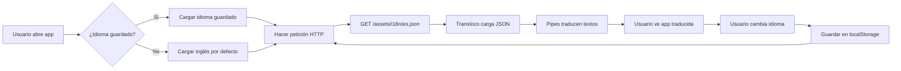

# Documentación: Sistema Multi-Idioma en NexCore

**Versión:** 1.0  
**Fecha:** Mayo 2026  
**Autor:** Equipo NexCore  

---

## 📋 Tabla de Contenidos

1. [Introducción](#introducción)
2. [¿Cómo funciona?](#cómo-funciona)
3. [Estructura de Archivos](#estructura-de-archivos)
4. [Configuración Inicial](#configuración-inicial)
5. [Uso en Plantillas HTML](#uso-en-plantillas-html)
6. [Agregar Nuevas Traducciones](#agregar-nuevas-traducciones)
7. [Cambio de Idioma en Runtime](#cambio-de-idioma-en-runtime)
8. [Persistencia del Idioma](#persistencia-del-idioma)
9. [Solución de Problemas](#solución-de-problemas)

---

## Introducción

NexCore utiliza un sistema de **internacionalización (i18n)** que permite mostrar la aplicación en múltiples idiomas. Actualmente soporta:

- 🇬🇧 **Inglés** (por defecto)
- 🇪🇸 **Español**

El sistema está basado en **Transloco**, una librería de Angular que carga traducciones dinámicamente desde archivos JSON.

### Ventajas del Sistema

✅ **Carga dinámica**: Solo carga el idioma activo  
✅ **Cambio en tiempo real**: El usuario puede cambiar de idioma sin recargar la página  
✅ **Persistencia**: El idioma seleccionado se guarda automáticamente  
✅ **Fácil mantenimiento**: Un archivo JSON por idioma  
✅ **Escalable**: Agregar nuevos idiomas es simple  

---

## ¿Cómo funciona?

### Flujo de Trabajo



### Componentes Principales

1. **Transloco Service**: Servicio central que gestiona las traducciones
2. **Loader (TranslocoHttpLoader)**: Carga archivos JSON vía HTTP
3. **Pipes**: `{{ 'key' | transloco }}` para traducir en templates
4. **Archivos JSON**: Contienen todas las traducciones por idioma
5. **LocalStorage**: Persiste el idioma seleccionado

---

## Estructura de Archivos

### Ubicación de Traducciones

```
nexcore-frontend/
└── src/
    └── assets/
        └── i18n/
            ├── en.json     ← Traducciones en inglés
            └── es.json     ← Traducciones en español
```

### Estructura del JSON

Los archivos JSON están organizados por **módulos/secciones** de la aplicación:

```json
{
  "navbar": {
    "profile": {
      "profile": "Profile",
      "settings": "Settings",
      "signOut": "Sign out"
    },
    "menu": {
      "dashboard": "Dashboard",
      "tenants": "Tenants"
    }
  },
  "dashboard": {
    "title": "Dashboard",
    "recentActivity": "Recent Activity",
    "table": {
      "user": "User",
      "action": "Action"
    }
  },
  "auth": {
    "login": {
      "title": "Sign In",
      "email": "Email"
    }
  }
}
```

### Archivo Inglés: `src/assets/i18n/en.json`

Contiene todas las claves en inglés (idioma por defecto).

### Archivo Español: `src/assets/i18n/es.json`

Contiene las mismas claves pero con valores en español.

**Importante:** Ambos archivos deben tener **exactamente las mismas claves**. Solo cambian los valores.

---

## Configuración Inicial

### 1. Instalación de Transloco

```bash
npm install @ngneat/transloco --save
```

### 2. Configuración en `app.config.ts`

Archivo: `src/app/app.config.ts`

```typescript
import { provideTransloco } from '@ngneat/transloco';
import { translocoConfig } from '@ngneat/transloco';
import { TranslocoHttpLoader } from './i18n/transloco.loader';
import { provideHttpClient } from '@angular/common/http';

export const appConfig: ApplicationConfig = {
  providers: [
    // HTTP client requerido por Transloco
    provideHttpClient(),
    
    // Configuración de Transloco
    provideTransloco({
      loader: TranslocoHttpLoader,
      config: translocoConfig({
        availableLangs: ['en', 'es'],     // Idiomas disponibles
        defaultLang: 'en',                 // Idioma por defecto
        fallbackLang: 'en',                // Idioma de respaldo
        reRenderOnLangChange: true,        // Re-renderizar al cambiar idioma
        prodMode: false                    // Modo desarrollo (mostrar warnings)
      })
    })
  ]
};
```

### 3. Loader personalizado

Archivo: `src/app/i18n/transloco.loader.ts`

```typescript
import { Injectable } from '@angular/core';
import { HttpClient } from '@angular/common/http';
import { TranslocoLoader, Translation } from '@ngneat/transloco';
import { Observable } from 'rxjs';

@Injectable({ providedIn: 'root' })
export class TranslocoHttpLoader implements TranslocoLoader {
  constructor(private http: HttpClient) {}

  getTranslation(lang: string): Observable<Translation> {
    // Carga el archivo JSON correspondiente al idioma
    const path = `/assets/i18n/${lang}.json`;
    return this.http.get<Translation>(path);
  }
}
```

### 4. Configuración de Assets en `angular.json`

Para que Angular sirva los archivos JSON, debes configurar la carpeta `assets`:

```json
{
  "architect": {
    "build": {
      "options": {
        "assets": [
          {
            "glob": "**/*",
            "input": "public"
          },
          {
            "glob": "**/*",
            "input": "src/assets",
            "output": "/assets/"
          }
        ]
      }
    }
  }
}
```

---

## Uso en Plantillas HTML

### Importar TranslocoModule

En cada componente standalone que use traducciones:

```typescript
import { TranslocoModule } from '@ngneat/transloco';

@Component({
  selector: 'app-dashboard',
  standalone: true,
  imports: [CommonModule, TranslocoModule],  // ← Importar aquí
  templateUrl: './dashboard.component.html'
})
export class DashboardComponent { }
```

### Pipe básico

```html
<h1>{{ 'dashboard.title' | transloco }}</h1>
<!-- Resultado: "Dashboard" (inglés) o "Panel" (español) -->
```

### Con parámetros

```html
<p>{{ 'dashboard.welcome_back' | transloco: { name: 'Juan' } }}</p>
<!-- Resultado: "Welcome back, Juan" o "Bienvenido de nuevo, Juan" -->
```

### En atributos

```html
<button [attr.title]="'navbar.profile.signOut' | transloco">
  <!-- title="Sign out" o title="Cerrar sesión" -->
</button>
```

### En tooltips dinámicos

```html
<a [attr.data-tooltip]="'navbar.menu.dashboard' | transloco">
  <span>{{ 'navbar.menu.dashboard' | transloco }}</span>
</a>
```

---

## Agregar Nuevas Traducciones

### Paso 1: Identificar el módulo

Decide en qué sección del JSON debe ir la traducción:
- `navbar`: Menú de navegación
- `dashboard`: Panel principal
- `auth`: Autenticación (login, registro, etc.)
- `shared`: Textos compartidos (botones, acciones comunes)

### Paso 2: Agregar clave en ambos idiomas

**En `src/assets/i18n/en.json`:**

```json
{
  "dashboard": {
    "title": "Dashboard",
    "newFeature": "New Feature",      ← Nueva clave
    "buttons": {
      "save": "Save Changes"          ← Nueva sección
    }
  }
}
```

**En `src/assets/i18n/es.json`:**

```json
{
  "dashboard": {
    "title": "Panel",
    "newFeature": "Nueva Funcionalidad",  ← Misma clave, valor en español
    "buttons": {
      "save": "Guardar Cambios"
    }
  }
}
```

### Paso 3: Usar en el template

```html
<h2>{{ 'dashboard.newFeature' | transloco }}</h2>
<button>{{ 'dashboard.buttons.save' | transloco }}</button>
```

### Ejemplo completo: Agregar nueva página

**1. Crear sección en JSONs:**

`en.json`:
```json
{
  "reports": {
    "title": "Reports",
    "subtitle": "View your analytics",
    "filters": {
      "dateRange": "Date Range",
      "export": "Export"
    }
  }
}
```

`es.json`:
```json
{
  "reports": {
    "title": "Reportes",
    "subtitle": "Ver tus analíticas",
    "filters": {
      "dateRange": "Rango de Fechas",
      "export": "Exportar"
    }
  }
}
```

**2. Usar en componente:**

```typescript
import { TranslocoModule } from '@ngneat/transloco';

@Component({
  selector: 'app-reports',
  standalone: true,
  imports: [CommonModule, TranslocoModule],
  template: `
    <h1>{{ 'reports.title' | transloco }}</h1>
    <p>{{ 'reports.subtitle' | transloco }}</p>
    <button>{{ 'reports.filters.export' | transloco }}</button>
  `
})
export class ReportsComponent { }
```

---

## Cambio de Idioma en Runtime

### Implementación en el Navbar

Archivo: `src/app/shared/layout/navbar.component.ts`

```typescript
import { TranslocoService } from '@ngneat/transloco';

export class NavbarComponent implements OnInit {
  private transloco = inject(TranslocoService);
  currentLang = 'en';
  showLangMenu = false;

  ngOnInit() {
    // Cargar idioma guardado o usar por defecto
    const savedLang = localStorage.getItem('nexcore-lang') || 'en';
    this.currentLang = savedLang;
    this.transloco.setActiveLang(savedLang);
  }

  changeLang(lang: string) {
    // 1. Cargar traducciones del idioma seleccionado
    this.transloco.load(lang).subscribe({
      next: () => {
        // 2. Actualizar idioma actual
        this.currentLang = lang;
        
        // 3. Guardar en localStorage
        localStorage.setItem('nexcore-lang', lang);
        
        // 4. Activar idioma en Transloco
        this.transloco.setActiveLang(lang);
        
        // 5. Cerrar menú
        this.showLangMenu = false;
      },
      error: (err) => {
        console.error('Error al cargar idioma', lang, err);
      }
    });
  }

  selectLang(lang: string) {
    this.changeLang(lang);
  }

  toggleLangMenu() {
    this.showLangMenu = !this.showLangMenu;
  }
}
```

### HTML del selector de idioma

```html
<div class="lang-compact-wrap">
  <!-- Botón para abrir menú -->
  <button class="lang-compact" (click)="toggleLangMenu()">🌐</button>
  
  <!-- Popup con idiomas -->
  <ul class="lang-popup" *ngIf="showLangMenu">
    <li class="lang-popup-item" 
        [class.active]="currentLang === 'en'"
        (click)="selectLang('en')">
      <span class="flag">🇬🇧</span>
      <span class="label">{{ 'navbar.lang.english' | transloco }}</span>
      <span class="check" *ngIf="currentLang === 'en'">✓</span>
    </li>
    
    <li class="lang-popup-item" 
        [class.active]="currentLang === 'es'"
        (click)="selectLang('es')">
      <span class="flag">🇪🇸</span>
      <span class="label">{{ 'navbar.lang.spanish' | transloco }}</span>
      <span class="check" *ngIf="currentLang === 'es'">✓</span>
    </li>
  </ul>
</div>
```

---

## Persistencia del Idioma

### ¿Dónde se guarda?

El idioma seleccionado se guarda en **localStorage** del navegador con la clave `nexcore-lang`.

```typescript
// Guardar idioma
localStorage.setItem('nexcore-lang', 'es');

// Leer idioma guardado
const savedLang = localStorage.getItem('nexcore-lang');
```

### Flujo de Persistencia

1. **Primera visita**: Usuario abre la app → carga inglés por defecto
2. **Cambio de idioma**: Usuario selecciona español → se guarda en localStorage
3. **Siguientes visitas**: App lee localStorage → carga español automáticamente
4. **Borrar caché**: Si se borra localStorage → vuelve a inglés por defecto

### Ver idioma guardado (DevTools)

1. Abre DevTools (F12)
2. Ve a la pestaña **Application**
3. En el menú izquierdo: **Storage** → **Local Storage**
4. Busca la clave `nexcore-lang`

---

## Solución de Problemas

### ❌ Problema: Muestra claves en lugar de traducciones

**Síntoma:** En pantalla aparece `dashboard.title` en lugar de "Dashboard"

**Causas posibles:**
1. Archivo JSON no encontrado (404)
2. JSON mal formado (error de sintaxis)
3. `TranslocoModule` no importado en el componente

**Solución:**
```bash
# 1. Verificar que existen los archivos
ls src/assets/i18n/
# Debe mostrar: en.json, es.json

# 2. Validar JSON
cat src/assets/i18n/en.json | jq .
# Si hay error de sintaxis, jq lo mostrará

# 3. Verificar que assets se copian en build
cat angular.json | grep -A 5 '"assets"'
# Debe incluir src/assets

# 4. Limpiar caché y reconstruir
rm -rf .angular dist
ng serve
```

### ❌ Problema: 404 al cargar JSON

**Síntoma:** Error en consola: `GET http://localhost:4200/assets/i18n/es.json 404`

**Solución:**
1. Verifica que los archivos existen en `src/assets/i18n/`
2. Confirma la configuración de `assets` en `angular.json`
3. Reinicia el servidor de desarrollo

```bash
# Verificar archivos
ls -la src/assets/i18n/

# Detener servidor
Ctrl+C

# Limpiar caché
rm -rf .angular

# Reiniciar servidor
ng serve --host 0.0.0.0
```

### ❌ Problema: No cambia de idioma al hacer click

**Síntoma:** El popup se cierra pero el texto no cambia

**Solución:**
```typescript
// Verificar que changeLang usa transloco.load()
changeLang(lang: string) {
  this.transloco.load(lang).subscribe({  // ← Importante: load() antes de setActiveLang()
    next: () => {
      this.currentLang = lang;
      localStorage.setItem('nexcore-lang', lang);
      this.transloco.setActiveLang(lang);
    }
  });
}
```

### ❌ Problema: Falta una traducción

**Síntoma:** Una palabra aparece en inglés aunque esté seleccionado español

**Solución:**
1. Verifica que la clave existe en ambos JSONs
2. Confirma que la clave es exactamente igual (case-sensitive)

```bash
# Buscar clave en ambos archivos
grep -n "dashboard.title" src/assets/i18n/*.json

# Debe aparecer en ambos:
# en.json:3:  "title": "Dashboard",
# es.json:3:  "title": "Panel",
```

### ❌ Problema: Error de sintaxis en JSON

**Síntoma:** App no carga o muestra error en consola

**Causas comunes:**
- Coma extra al final de una línea
- Falta una comilla
- Falta un corchete o llave de cierre

**Solución:**
```bash
# Validar JSON con jq
jq . src/assets/i18n/en.json
jq . src/assets/i18n/es.json

# Si hay error, jq mostrará la línea exacta
# parse error: Expected separator between values at line 5, column 8
```

**Usar un validador online:**
- https://jsonlint.com/
- Pegar el contenido del JSON
- Ver errores de sintaxis

---

## Agregar un Nuevo Idioma (Ejemplo: Francés)

### Paso 1: Crear archivo de traducción

```bash
# Copiar archivo base
cp src/assets/i18n/en.json src/assets/i18n/fr.json
```

### Paso 2: Traducir contenido

Editar `src/assets/i18n/fr.json`:

```json
{
  "navbar": {
    "profile": {
      "profile": "Profil",
      "settings": "Paramètres",
      "signOut": "Se déconnecter"
    }
  },
  "dashboard": {
    "title": "Tableau de bord"
  }
}
```

### Paso 3: Agregar a configuración

En `src/app/app.config.ts`:

```typescript
config: translocoConfig({
  availableLangs: ['en', 'es', 'fr'],  // ← Agregar 'fr'
  defaultLang: 'en',
  fallbackLang: 'en'
})
```

### Paso 4: Agregar opción en selector

En `navbar.component.html`:

```html
<li class="lang-popup-item" 
    [class.active]="currentLang === 'fr'"
    (click)="selectLang('fr')">
  <span class="flag">🇫🇷</span>
  <span class="label">Français</span>
  <span class="check" *ngIf="currentLang === 'fr'">✓</span>
</li>
```

---

## Mejores Prácticas

### 1. Nombrado de Claves

✅ **Bueno:**
```json
{
  "dashboard": {
    "title": "Dashboard",
    "table": {
      "user": "User"
    }
  }
}
```

❌ **Malo:**
```json
{
  "DashboardTitle": "Dashboard",
  "table_user": "User"
}
```

**Reglas:**
- Usa `camelCase` para las claves
- Organiza jerárquicamente por módulo/sección
- Nombres descriptivos y en inglés

### 2. Consistencia

✅ **Ambos archivos deben tener las mismas claves:**

`en.json`:
```json
{
  "buttons": {
    "save": "Save",
    "cancel": "Cancel"
  }
}
```

`es.json`:
```json
{
  "buttons": {
    "save": "Guardar",
    "cancel": "Cancelar"
  }
}
```

### 3. Comentarios de Contexto

Aunque JSON no admite comentarios, usa claves descriptivas:

```json
{
  "auth": {
    "login": {
      "emailPlaceholder": "Enter your email",  // Claro: es un placeholder
      "submitButton": "Sign In"                 // Claro: es el texto del botón
    }
  }
}
```

### 4. Usar Fallbacks

Siempre configura `fallbackLang`:

```typescript
config: translocoConfig({
  fallbackLang: 'en'  // Si falta una traducción, usa inglés
})
```

### 5. Textos con Variables

```json
{
  "greetings": {
    "welcome": "Welcome, {{name}}!",
    "itemsCount": "You have {{count}} items"
  }
}
```

Uso:
```html
<p>{{ 'greetings.welcome' | transloco: { name: userName } }}</p>
<p>{{ 'greetings.itemsCount' | transloco: { count: 5 } }}</p>
```

---

## Checklist de Implementación

### Al agregar una nueva página/componente:

- [ ] Importar `TranslocoModule` en el componente
- [ ] Agregar claves en `en.json`
- [ ] Agregar traducciones en `es.json`
- [ ] Reemplazar textos estáticos con pipes `| transloco`
- [ ] Probar cambiando de idioma en la UI
- [ ] Verificar que no hay claves literales en pantalla
- [ ] Validar JSON con `jq` o jsonlint

### Al desplegar a producción:

- [ ] Ejecutar `ng build --configuration production`
- [ ] Verificar que `/assets/i18n/` se copia al dist
- [ ] Probar en navegador privado (caché limpia)
- [ ] Confirmar que localStorage persiste el idioma
- [ ] Verificar Network tab: JSONs se cargan correctamente

---

## Recursos Adicionales

- **Transloco Docs:** https://ngneat.github.io/transloco/
- **Angular i18n Guide:** https://angular.io/guide/i18n
- **JSON Validator:** https://jsonlint.com/

---

## Contacto y Soporte

Para preguntas o problemas con el sistema de multi-idioma:

- **Documentación técnica:** Ver `/spec/` en el repositorio
- **Reportar bugs:** Crear issue en el repositorio del proyecto
- **Dudas de implementación:** Contactar al equipo de desarrollo

---

**Última actualización:** Mayo 2026  
**Versión del documento:** 1.0
